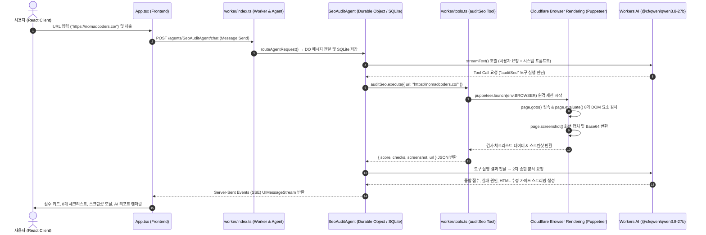

# [Architecture & Flow Logic] my09-auditweb 요청 처리 상세 흐름도

사용자가 웹사이트 URL을 입력했을 때 프론트엔드부터 백엔드 Cloudflare Worker, Durable Object, Puppeteer 브라우저 자동화, LLM(Qwen 3.8 27B) 및 프론트엔드 실시간 렌더링까지 전체 소스 코드의 진행 경로를 상세히 기록합니다.

---

## 🛠️ 전체 시스템 구조 및 데이터 흐름 요약

---

## 🔍 상세 소스 코드 실행 단계 (Step-by-Step)

### 1단계: 프론트엔드 사용자 입력 및 이벤트 발생 (`src/App.tsx`)
1. **사용자 액션**: 하단 입력 폼에 `https://nomadcoders.co/` 입력 후 제출 버튼 클릭.
2. **이벤트 핸들러 실행**:
   - `handleSubmit(e: React.SyntheticEvent<HTMLFormElement>)` 핸들러가 호출됩니다.
   - `formData.get("input")`에서 입력된 URL 텍스트 추출 후 `@cloudflare/ai-chat/react`의 `sendMessage({ text: message })`를 실행합니다.
3. **HTTP/WebSocket 통신**:
   - `useAgentChat()` 훅이 백엔드 Worker의 Durable Object 에이전트 경로(`/agents/SeoAuditAgent/chat`)로 메시지를 전송합니다.

---

### 2단계: 백엔드 라우팅 및 Durable Object 동기화 (`worker/index.ts`)
1. **Worker 진입점 수신**:
   - Cloudflare Worker 메인 핸들러 `export default { fetch }`가 들어오는 요청을 수신합니다.
2. **에이전트 라우터 호출**:
   - `routeAgentRequest(request, env)`가 실행되어 요청 대상 에이전트인 `SeoAuditAgent` (Durable Object 클래스)를 식별하고 라우팅합니다.
3. **상태 저장 (Persistence)**:
   - `AIChatAgent`를 상속받은 `SeoAuditAgent` 내 내장 SQLite DB에 새로운 사용자 메시지가 저장되어 히스토리가 유지됩니다.

---

### 3단계: AI 에이전트 추론 및 도구 호출 결정 (`worker/index.ts`)
1. **`onChatMessage` 실행**:
   - 에이전트 클래스의 `onChatMessage` 메소드가 자동 호출됩니다.
2. **Workers AI 바인딩 및 도구 세트 생성**:
   - `createWorkersAI({ binding: this.env.AI })`를 통해 Cloudflare AI 바인딩 연결을 생성합니다.
   - `createAuditTools(this.env)`를 호출하여 `auditSeo` 도구 객체를 준비합니다.
3. **LLM `streamText` 호출**:
   - `@cf/qwen/qwen3.8-27b` 모델에게 대화 기록(`this.messages`), 전문 SEO 시스템 프롬프트, 도구 명세를 전달하여 실행을 시작합니다.
4. **Tool Call 판단**:
   - Qwen 3.8 27B 모델이 시스템 프롬프트("사용자가 웹사이트 URL을 제공하면 반드시 `auditSeo` 도구를 호출하세요")에 따라 `auditSeo({ url: "https://nomadcoders.co/" })` 도구 실행 명령을 결정합니다.

---

### 4단계: Puppeteer 브라우저 자동화 및 SEO 검사 수행 (`worker/tools.ts`)
1. **`auditSeo.execute()` 진입**:
   - 도구 실행 함수가 호출되며, `Promise.race([auditLogic(), timeoutPromise])`를 통해 **최대 12초 하드 타임아웃** 방어막이 활성화됩니다.
2. **Cloudflare Remote Browser 세션 시작**:
   - `puppeteer.launch(env.BROWSER)`를 호출하여 Cloudflare 인프라 샌드박스의 헤드리스 크롬 인스턴스 세션을 생성합니다.
3. **페이지 접속 및 렌더링**:
   - `page.newPage()` 생성 및 `page.setViewport({ width: 1280, height: 800 })` 설정.
   - `page.goto(targetUrl, { waitUntil: "domcontentloaded", timeout: 8000 })`로 웹페이지에 빠르게 접속합니다.
4. **브라우저 DOM 내 8개 핵심 SEO 요소 정밀 검사 (`page.evaluate()`)**:
   - **Title**: `<title>` 태그 존재 유무 및 길이(10~60자) 체크
   - **Description**: `<meta name="description">` 존재 유무 및 길이(50~160자) 체크
   - **H1**: 페이지 내 `<h1>` 태그가 정확히 1개 존재하는가 체크
   - **Img Alt**: 모든 `` 태그의 `alt` 속성 누락 유무 체크
   - **Open Graph**: `<meta property="og:title">`과 `<meta property="og:image">` 존재 여부 체크
   - **Canonical**: `<link rel="canonical">` 대표 URL 지정 유무 체크
   - **Viewport**: `<meta name="viewport">` 반응형 태그 유무 체크
   - **HTML Lang**: `<html>` 태그 `lang` 언어 속성 유무 체크
5. **스크린샷 캡처 및 안전 인코딩**:
   - `page.screenshot({ type: "jpeg", quality: 50 })`로 화면 캡처 버퍼를 획득합니다.
   - `Buffer.from(screenshotBuffer).toString("base64")`를 적용하여 콜스택 오버플로우 없이 빠르게 base64 스트링으로 변환합니다.
6. **점수 계산 및 리소스 정리**:
   - `passedCount * 12.5`로 100점 만점 점수를 계산하고 `browser.close()`로 원격 세션을 반납합니다.
   - 결과 JSON 객체(`{ url, score, passedCount, totalCount, checks, screenshot }`)를 LLM 및 프론트엔드로 반환합니다.

---

### 5단계: LLM 2차 종합 리포트 생성 및 SSE 스트리밍 (`worker/index.ts`)
1. **도구 결과 수신**:
   - LLM(Qwen 3.8 27B)이 `auditSeo` 도구가 반환한 점수 및 체크리스트 JSON을 수신합니다.
2. **2차 추론 및 리포트 작성**:
   - 종합 점수 요약, 실패한 항목에 대한 구체적 원인 분석, 개발자가 바로 사용할 수 있는 HTML 수정 코드 가이드, 추가 개선 제언을 작성합니다.
3. **SSE 스트리밍 전송**:
   - `result.toUIMessageStreamResponse()`를 통해 처리 결과 데이터를 Server-Sent Events 형태로 클라이언트로 실시간 전송합니다.

---

### 6단계: 프론트엔드 UI 실시간 시각화 렌더링 (`src/App.tsx`)
1. **스트림 감지 및 상태 갱신**:
   - `useAgentChat()` 훅이 메시지 파트(`msg.parts`) 업데이트를 수신합니다.
2. **도구 실행 중 UI**:
   - `isToolUIPart(part)`가 도구 실행 중일 때: `[auditSeo] 실행 중... (Puppeteer 브라우저 렌더링)` 애니메이션 바를 표시합니다.
3. **도구 결과 완료 (`output-available`)**:
   - `renderAuditCard(output)`가 실행되어:
     - **점수 뱃지**: 0~100점 (80+ Emerald, 50~79 Amber, <50 Rose) 시각화 카드 렌더링
     - **8개 체크리스트 Grid**: 통과/실패 항목별 PASS/FAIL 뱃지 및 실제 발견된 값 표시
     - **스크린샷 모달 버튼**: 캡처된 원본 이미지를 팝업 모달로 크게 볼 수 있는 버튼 렌더링
4. **마크다운 리포트 출력**:
   - LLM이 실시간으로 생성하는 마크다운 설명 텍스트가 화면 아래에 타이핑 효과처럼 스트리밍 렌더링됩니다.
