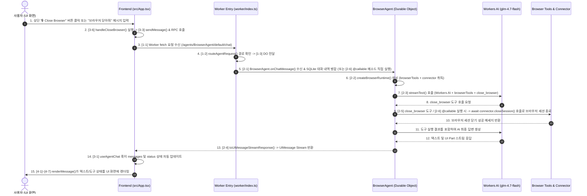

# 05. my09-browser 챗 메시지 처리 및 화면 렌더링 상세 로직 가이드 (콘솔 로그 순서 포함)

본 문서는 사용자가 웹 화면에서 텍스트 메시지를 입력하고 전송 버튼을 눌렀을 때부터, Cloudflare Workers/Durable Objects 백엔드가 이를 수신하고, `@cf/zai-org/glm-4.7-flash` AI 모델 및 브라우저 제어 도구(`createBrowserTools`/`createBrowserRuntime`)가 실행된 후, 다시 프론트엔드 화면에 스트리밍으로 렌더링되는 전체 순서와 **소스코드에 매겨진 콘솔 로그(`console.log`) 번호별 로직 흐름**, 그리고 **상단 버튼("🔒 Close Browser") 및 RPC/도구를 통한 브라우저 세션 종료 기능**을 상세히 설명합니다.

---

## 🔄 1. 전체 데이터 흐름 시퀀스 및 Console Log 번호



---

## 📂 2. 콘솔 로그 번호별 상세 코드 및 역할 설명

---

### 🅰️ [1단계] Worker 서버 진입점 영역 (`my09-browser/worker/index.ts`)

#### `[1-1] [Worker fetch]`
```typescript
console.log(`[1-1] [Worker fetch] 🌐 수신된 요청 URL: ${request.method} ${url.pathname}`);
```
- **역할**: 클라이언트 브라우저에서 서버로 들어오는 모든 HTTP 및 WebSocket 요청의 HTTP 메서드와 URL 경로를 출력합니다.

#### `[1-2] [Worker fetch]`
```typescript
console.log(`[1-2] [Worker fetch] 🔀 /agents/ 경로 감지 -> routeAgentRequest()에 라우팅 전달`);
```
- **역할**: 요청 URL 경로가 `/agents/`로 시작하는 에이전트 통신일 경우, `agents` SDK의 `routeAgentRequest()` 라우터로 넘기는 시점을 알립니다.

#### `[1-3] [Worker fetch]`
```typescript
console.log(`[1-3] [Worker fetch] ✅ Agent 라우팅 성공 응답 생성`);
```
- **역할**: `routeAgentRequest()`가 성공적으로 대응하는 Durable Object(`BrowserAgent`)를 찾아 응답(WebSocket 커넥션 또는 HTTP Stream)을 형성했음을 알립니다.

#### `[1-4] [Worker fetch]`
```typescript
console.log(`[1-4] [Worker fetch] 📂 정적 자산(ASSETS) 서빙 처리`);
```
- **역할**: 에이전트 요청이 아닌 일반 정적 파일(HTML, JS, CSS 등) 요청일 경우, `env.ASSETS`로 넘겨 서빙함을 알립니다.

---

### 🅱️ [2단계] Durable Object 에이전트 영역 (`BrowserAgent` in `worker/index.ts`)

#### `[2-1] [BrowserAgent DO onChatMessage]`
```typescript
console.log(`[2-1] [BrowserAgent DO onChatMessage] 📩 신규 대화 메시지 수신! (총 보관 메시지: ${this.messages.length}개)`);
```
- **역할**: 클라이언트가 전송한 신규 메시지가 Durable Object 인스턴스에 도착했을 때 실행되며, 현재 SQLite DB에 저장된 총 메시지 수량을 출력합니다.

#### `[2-2] [BrowserAgent DO]`
```typescript
console.log(`[2-2] [BrowserAgent DO] 🛠️ createBrowserRuntime 생성 (BROWSER & LOADER 바인딩 연동)`);
```
- **역할**: `createBrowserRuntime`을 호출하여 Cloudflare Browser Rendering(Puppeteer) 연동 자동화 도구(`browserTools`)와 브라우저 커넥터(`connector`)를 생성합니다.

#### `[2-3] [BrowserAgent DO]`
```typescript
console.log(`[2-3] [BrowserAgent DO] 🤖 Workers AI (@cf/zai-org/glm-4.7-flash) streamText() 실행 시작`);
```
- **역할**: Cloudflare Workers AI의 `@cf/zai-org/glm-4.7-flash` 모델에 대화 내역, 브라우저 조작 도구, 그리고 세션 종료 도구(`close_browser`)를 입력하여 AI 스트리밍 응답(`streamText`) 생성을 시작합니다.

#### `[2-4] [BrowserAgent DO]`
```typescript
console.log(`[2-4] [BrowserAgent DO] 🌊 toUIMessageStreamResponse() 스트림 응답 반환 완료`);
```
- **역할**: AI 응답과 도구 호출 상태(UI Message Stream)를 클라이언트로 실시간 전송하기 위해 Response 스트림 객체를 반환합니다.

#### `[2-5] [BrowserAgent DO]` (🔒 **브라우저 세션 닫기 도구**)
```typescript
console.log(`[2-5] [BrowserAgent DO] 🔒 close_browser 도구 실행: 브라우저 세션을 닫습니다.`);
await connector.closeSession();
```
- **역할**: AI 모델이 사용자의 요구("브라우저 닫아줘", "작업 종료해줘" 등)에 따라 `close_browser` 도구를 실행하여 `connector.closeSession()`을 호출하고 브라우저 세션을 명시적으로 닫습니다.

#### `[2-6] [BrowserAgent DO]` (🔒 **RPC 직접 호출 메서드**)
```typescript
@callable()
async closeBrowserSession() {
  console.log(`[2-6] [BrowserAgent DO] 🔒 @callable closeBrowserSession() 직접 호출됨`);
  const { connector } = createBrowserRuntime({
    ctx: this.ctx,
    browser: this.env.BROWSER,
    loader: this.env.LOADER,
  });
  await connector.closeSession();
  return { success: true, message: "브라우저 세션이 성공적으로 닫혔습니다." };
}
```
- **역할**: 클라이언트 상단 **"🔒 Close Browser"** 버튼 클릭 시 RPC 방식으로 직접 호출되어 브라우저 세션을 즉시 강제 종료합니다.

---

### 🅲 [3단계] 프론트엔드 사용자 입력 및 상태 관리 (`src/App.tsx`)

#### `[3-0] [App Component]`
```typescript
console.log(`[3-0] [App Component] 🎨 App 렌더링 호출됨`);
```
- **역할**: React `App` 컴포넌트 함수가 렌더링될 때마다 찍히는 로그입니다.

#### `[3-1] [App State]`
```typescript
console.log(`[3-1] [App State] 현재 Agent 상태 status: "${status}", 보관된 메시지 수: ${messages.length}개`);
```
- **역할**: 현재 에이전트의 통신 상태(`"idle"`, `"submitting"`, `"streaming"` 등) 및 클라이언트에 수신된 메시지 수량을 출력합니다.

#### `[3-2] [App handleSubmit]`
```typescript
console.log(`[3-2] [App handleSubmit] 🚀 폼 제출 이벤트 발생! 입력된 텍스트: "${message}"`);
```
- **역할**: 사용자가 입력창에 텍스트를 입력하고 `Send` 버튼을 누르거나 엔터를 쳤을 때 제출된 입력 문자열을 출력합니다.

#### `[3-3] [App handleSubmit]`
```typescript
console.log(`[3-3] [App handleSubmit] 📤 백엔드로 sendMessage({ text }) 호출`);
```
- **역할**: `useAgentChat`의 `sendMessage` 함수를 통해 백엔드 Worker로 사용자 입력 데이터를 전송하는 직전 시점입니다.

#### `[3-4] [App clearHistory]` / `[3-5] [App stop]` / `[3-6] [App handleCloseBrowser]`
```typescript
console.log(`[3-4] [App clearHistory] 🧹 대화 내역 초기화 실행`);
console.log(`[3-5] [App stop] 🛑 AI 생성 중단 실행`);
console.log(`[3-6] [App handleCloseBrowser] 🔒 상단 'Close Browser' 버튼 클릭`);
```
- **역할**: 상단 헤더의 `Clear`, `Stop`, 및 **`Close Browser`** 버튼 클릭 시 동작하는 추적 및 제어 로그입니다.

---

### 🅳 [4단계] 프론트엔드 UI 스트리밍 렌더링 (`renderMessage` in `src/App.tsx`)

#### `[4-1] [App renderMessage]`
```typescript
console.log(`[4-1] [App renderMessage] ✉️ 메시지 ID: ${msg.id}, 역할: ${msg.role}, 조각(parts) 개수: ${msg.parts.length}`);
```
- **역할**: 화면에 대화 메시지 카드 하나를 그릴 때, 해당 메시지의 ID, 역할(`user` / `assistant`), 조각(part)의 총 개수를 출력합니다.

#### `[4-2] [App renderMessage]`
```typescript
console.log(`[4-2] [App renderMessage] 📄 [text part] 렌더링: "${part.text.slice(0, 30)}..."`);
```
- **역할**: AI 응답 메시지 조각 중 일반 텍스트 문장을 화면에 출력할 때 텍스트 앞부분을 로그로 보여줍니다.

#### `[4-3] [App renderMessage]`
```typescript
console.log(`[4-3] [App renderMessage] 🧠 [reasoning part] 렌더링`);
```
- **역할**: AI의 추론(Thinking) 과정 텍스트 렌더링 시 찍히는 로그입니다.

#### `[4-4] [App renderMessage]`
```typescript
console.log(`[4-4] [App renderMessage] 🛠️ [tool part] 렌더링 - 도구명: "${toolName}", 상태: "${part.state}"`);
```
- **역할**: AI가 브라우저 자동화 도구(Puppeteer)를 호출하거나 실행 결과를 반환받았을 때, 도구 이름과 상태(`"approval-requested"`, `"output-available"` 등)를 출력합니다.

#### `[4-5] [App renderMessage]` / `[4-6] [App Approve Click]` / `[4-7] [App Reject Click]`
```typescript
console.log(`[4-5] [App renderMessage] ⚠️ 도구 실행 승인 요청 카드 렌더링 - id: ${part.approval.id}`);
console.log(`[4-6] [App Approve Click] ✅ 승인 버튼 클릭 - id: ${part.approval.id}`);
console.log(`[4-7] [App Reject Click] ❌ 거절 버튼 클릭 - id: ${part.approval.id}`);
```
- **역할**: AI가 브라우저 조작 권한 승인을 요구할 때 나타나는 카드 렌더링 및 사용자가 `Approve` / `Reject` 버튼을 눌렀을 때의 인터랙션 추적 로그입니다.
