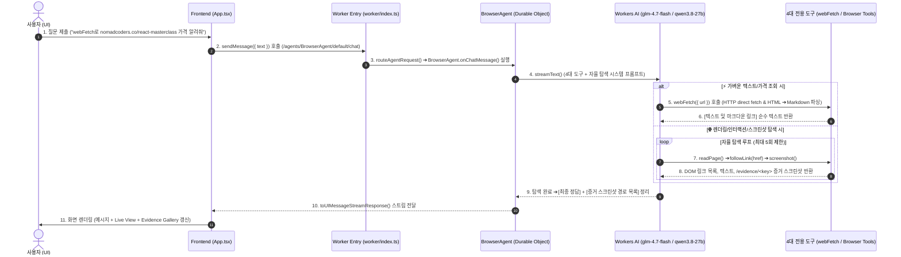

# 05. my09-browserUpgrade 자율 탐색 알고리즘 및 4대 도구 로직 설명서

본 문서는 `my09-browserUpgrade`에 탑재된 **4대 전용 도구(webFetch, readPage, followLink, screenshot)**와 자율 탐색 알고리즘(Self-Browsing Protocol)을 설명합니다.

---

## 🔄 1. 자율 탐색 시퀀스 디아그램

---

## 🛠️ 2. 4대 전용 도구 상세 설명

1. **⚡ `webFetch({ url })`**:
   - 브라우저를 띄우지 않고 HTTP `fetch(url)`를 수행하여 HTML을 수신합니다.
   - `<script>`, `<style>` 태그를 제거하고 `<a href="...">text</a>`를 `[text](href)` 마크다운 링크로 변환 후 정돈된 순수 텍스트를 반환합니다.
   - 가격, 코스 상세 정보, 글 목록 등을 초고속으로 조회할 때 가장 효율적입니다.

2. **📖 `readPage({ url? })`**:
   - Headless Chrome 세션 상에서 현재 DOM의 본문 텍스트와 모든 클릭 가능 앵커 태그 링크(`{ text, href }[]`)를 추출합니다.

3. **🔗 `followLink({ href })`**:
   - `page.goto(href)`로 탐색 페이지를 이동하고, 이동 후 스크린샷을 찍어 `/evidence/<key>` 타임스탬프 스크린샷 키로 기록합니다.

4. **📸 `screenshot()`**:
   - 요청 즉시 현재 브라우저 탭 화면을 캡처하고 `/evidence/<key>`에 등록합니다.

---

## 🎯 3. 시스템 프롬프트 및 탐색 규칙

1. **전략적 도구 선택**:
   - 가벼운 텍스트/가격 검색 ➔ `webFetch` 우선 사용.
   - 화면 구조 파악 및 스크린샷 필요 ➔ `readPage` 및 `followLink` 사용.
2. **최대 5회 한도 (Max 5 Steps)**:
   - 과도한 실행 시간 방지를 위해 5회 초과 시 수집된 정보로 즉시 최종 응답.
3. **결과 보고 양식**:
   - 🎯 **[최종 정답]**: 핵심 질문 답변
   - 📍 **[증거 스크린샷 목록 /evidence/<key>]**: 각 Step별 저장된 이미지 링크
