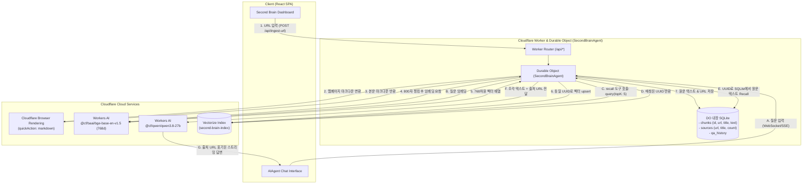

# 🧠 Second Brain RAG Agent 개발 명세서 (05_dev_spec.md)

## 1. 프로젝트 개요
`my10-raghomework`는 Cloudflare의 차세대 서버리스 기술인 **Durable Objects (SQLite 내장)**, **Vectorize (벡터 데이터베이스)**, **Workers AI (@cf/qwen/qwen3.8-27b, @cf/baai/bge-base-en-v1.5)** 및 **Browser Rendering (마크다운 변환)**을 결합하여 구축한 **개인용 AI 세컨드 브레인(Second Brain) 지식 관리 시스템**입니다.

사용자가 웹 서핑 중 기억해두고 싶은 웹페이지 URL을 입력하면, 브라우저 렌더링 엔진이 본문을 마크다운으로 추출하고, 약 800자 단위로 분할하여 BGE-base 임베딩 벡터와 함께 Vectorize 및 Durable Object 내장 SQLite에 동기화 저장합니다.

AI 에이전트와 대화할 때 질문과 관련된 지식을 자동으로 **소환(Recall)**하여 **반드시 출처 URL을 명시**하면서 정확하고 신뢰성 높은 답변을 생성합니다.

---

## 2. 시스템 아키텍처 및 데이터 흐름



---

## 3. 핵심 아키텍처 설계: Vectorize와 SQLite의 역할 분담 (하이브리드 RAG)

일반적인 RAG 시스템에서 벡터 데이터베이스에 본문 텍스트 전체를 메타데이터로 저장하는 방식은 다음과 같은 한계가 있습니다:
1. **메타데이터 크기 제한**: Cloudflare Vectorize는 벡터당 메타데이터 크기 제한(10KiB)이 있어, 긴 본문 텍스트나 다양한 메타데이터를 저장하기 어렵습니다.
2. **비용 및 쿼리 효율성**: 대량의 텍스트가 메타데이터에 포함되면 인덱스 탐색 및 메모리 대역폭이 낭비됩니다.

### 해결책: ID 기반 분리 저장 (UUID 일치화)
- **Vectorize (`second-brain-index`)**: 오직 BGE-base 임베딩 벡터(768차원)와 최소한의 메타데이터(`{ source: url, title: string }`)만 보관하여 초고속 코사인 유사도 검색 수행.
- **Durable Object 내장 SQLite (`chunks` 테이블)**: 각 조각의 실제 원문 텍스트(`text`)는 Vectorize에 upsert된 것과 동일한 `crypto.randomUUID()`를 Primary Key로 저장.
- **Recall 도구 실행 시**:
  1. 질문 텍스트 ➜ 임베딩 ➜ Vectorize 검색 (`topK: 5`)
  2. 반환된 5개의 `id`를 바탕으로 SQLite에서 `SELECT * FROM chunks WHERE id = ?` 즉시 역조회
  3. 손실 없는 원문 텍스트와 정확한 출처 URL을 복원하여 LLM 모델에 전달.

---

## 4. 데이터베이스 스키마 (Durable Object SQLite)

Durable Object 클래스 `onStart()` 생명주기 메서드에서 자동으로 생성되는 3개 테이블입니다.

### 1) 지식 조각 테이블 (`chunks`)
```sql
CREATE TABLE IF NOT EXISTS chunks (
  id TEXT PRIMARY KEY,        -- Vectorize의 벡터 ID와 1:1 일치 (UUID)
  url TEXT NOT NULL,          -- 출처 웹페이지 URL
  title TEXT,                 -- 웹페이지 제목
  text TEXT NOT NULL,         -- 약 800자 단위의 분할 원문 마크다운 본문
  created_at INTEGER          -- 저장 시각 타임스탬프 (Unix epoch ms)
);
```

### 2) 출처 메타데이터 테이블 (`sources`)
```sql
CREATE TABLE IF NOT EXISTS sources (
  url TEXT PRIMARY KEY,        -- 등록된 웹페이지 URL
  title TEXT,                  -- 웹페이지 제목
  chunks_count INTEGER,        -- 생성된 총 청크 개수
  created_at TEXT NOT NULL     -- 최초 저장 시각 (ISO8601)
);
```

### 3) 질의응답 이력 테이블 (`qa_history`)
```sql
CREATE TABLE IF NOT EXISTS qa_history (
  id TEXT PRIMARY KEY,         -- Q&A 고유 ID (예: qa_172578..._abc)
  question TEXT NOT NULL,      -- 사용자 질문
  answer TEXT NOT NULL,        -- 모델 답변
  sources TEXT,                -- 참조된 출처 URL 목록 (JSON)
  created_at TEXT NOT NULL     -- 대화 시각 (ISO8601)
);
```

---

## 5. Cloudflare Browser Rendering & 마크다운 API

### 1) Browser Rendering 바인딩 (`MYBROWSER`)
`wrangler.jsonc`에 `browser` 바인딩을 선언합니다:
```jsonc
"browser": {
  "binding": "MYBROWSER"
}
```

### 2) Quick Action 마크다운 변환
Worker 내부에서 Cloudflare 브라우저 인스턴스를 기동하여 대상 웹페이지를 headless로 렌더링한 후, JavaScript 실행 결과 및 스타일이 반영된 최적화된 마크다운을 직접 추출합니다:
```typescript
const res = await this.env.MYBROWSER.quickAction("markdown", { url });
if (res.ok) {
  const data = await res.json();
  // data.result: 추출된 마크다운 본문
  // data.meta.title: 웹페이지 제목
}
```

### 3) 2단계 Fallback 아키텍처
브라우저 렌더링이 일시적으로 지연되거나 외부 네트워크 제한이 있을 경우를 대비하여 다음 2단계 대체 파서를 내장했습니다:
- **Fallback 1**: `Accept: text/markdown` 헤더 기반 direct fetch (최신 AI 친화적 웹사이트 직접 응답).
- **Fallback 2**: 표준 HTML fetch 후 정규식을 통한 `<script>`, `<style>`, `<nav>`, `<footer>` 태그 제거 및 순수 텍스트 정제.

---

## 6. 에이전트 도구(ToolSet) 상세 명세

AI SDK v6 (`inputSchema`) 기반으로 정의된 세컨드 브레인 전용 도구들입니다.

### 1) `recall` 도구
- **목적**: 세컨드 브레인에 저장된 웹페이지 지식 조각들을 벡터 유사도로 검색하여 원문과 출처 URL을 복원.
- **입력 스키마**:
  ```typescript
  inputSchema: z.object({
    question: z.string().describe("검색할 질문 또는 키워드"),
  })
  ```
- **실행 로직**:
  1. `workersAi.textEmbeddingModel("@cf/baai/bge-base-en-v1.5")`로 `question` 임베딩 생성 (768차원).
  2. `this.env.VECTORIZE.query(embedding, { topK: 5, returnMetadata: "all" })` 호출.
  3. 매칭된 각 벡터의 ID로 `this.sql` chunks 테이블에서 `text`, `url`, `title` 조회.
  4. 매칭 점수(Relevance Score, %) 및 순위별 조각 목록을 객체로 반환.

### 2) `listSources` 도구
- **목적**: 현재 세컨드 브레인이 기억하고 있는 모든 웹페이지 출처와 메타데이터 목록 반환.
- **입력 스키마**:
  ```typescript
  inputSchema: z.object({})
  ```
- **실행 로직**:
  1. `this.sql` sources 테이블에서 등록 일시 역순(`ORDER BY created_at DESC`)으로 전체 행 조회.
  2. 총 저장된 출처 개수 및 `url`, `title`, `chunks_count`, `created_at` 배열 반환.

---

## 7. 시스템 프롬프트 및 인용(출처 URL) 정책

에이전트는 사용자의 질문에 답변할 때 항상 근거를 명확히 밝히도록 엄격한 시스템 프롬프트를 적용받습니다:

```text
당신은 사용자가 저장한 웹페이지들을 기억하고 지식을 연결해주는 개인용 '세컨드 브레인(Second Brain)' AI 어시스턴트입니다.

[원칙과 행동 지침]
1. 사용자가 웹페이지 내용이나 지식에 대해 물어보면 **반드시 recall 도구를 호출**하여 세컨드 브레인에 저장된 조각 텍스트를 검색하세요.
2. 불러온 조각 내용을 가장 중요한 근거로 삼아 답변을 구성하세요.
3. **[필수] 답변 시 항상 근거가 된 출처 URL과 페이지 제목을 명확히 밝히세요.** (예: 출처: [Cloudflare Workers 공식문서](https://...))
4. 사용자가 어떤 웹페이지들이 저장되어 있는지 알고 싶어 하면 **listSources 도구를 호출**하여 목록을 안내하세요.
5. 저장된 지식 조각에 없는 내용이거나 알 수 없는 경우, 지어내지 말고 "세컨드 브레인에 아직 해당 내용에 대한 웹페이지가 저장되어 있지 않습니다"라고 정직하게 안내하고, 관련 URL을 채팅창에 입력해주면 기억하겠다고 제안하세요.
6. 모든 답변은 마크다운 문법(제목, 글머리 기호, 볼드체, 링크)을 사용하여 읽기 편하게 한국어로 작성하세요.
```

---

## 8. HTTP API 엔드포인트 명세

| Method | Endpoint | 설명 | 요청 본문 (Payload) | 응답 예시 |
|---|---|---|---|---|
| `POST` | `/api/ingest-url` | 웹페이지 마크다운 변환 및 세컨드브레인 인제스트 | `{"url": "https://..."}` | `{"success": true, "data": {"title": "...", "chunksCount": 12}}` |
| `GET` | `/api/sources` | 기억된 모든 웹페이지 출처 목록 조회 | None | `{"sources": [...], "count": 3}` |
| `DELETE`| `/api/sources?url=...`| 특정 웹페이지 및 연관 벡터/청크 삭제 | Query: `url` 또는 `{"url": "..."}` | `{"success": true, "message": "삭제 완료", "data": {"deletedChunks": 12}}` |
| `DELETE`| `/api/sources` (전체) | 세컨드 브레인 전체 기억 초기화 | `{"all": true}` | `{"success": true, "data": {"deletedChunks": 48}}` |
| `GET` | `/api/chunks?url=...` | 특정 URL 또는 전체 청크 텍스트 조회 | Query: `url` (선택) | `{"chunks": [...], "count": 24}` |
| `GET/POST`| `/agents/SecondBrainAgent/*`| AIAgent 대화 엔드포인트 (SSE/WebSocket) | Agent Protocol | 스트리밍 응답 (UIMessageStream) |

### 기억 삭제(Delete) 내부 메커니즘
1. **SQLite Chunks ID 조회**: 삭제 대상 `url`과 일치하는 모든 청크의 고유 UUID(`id`) 목록 추출
2. **Vectorize `deleteByIds` 호출**: 추출된 UUID 배열을 100개 단위 배치로 나누어 `env.VECTORIZE.deleteByIds(batch)`를 실행하여 인덱스에서 벡터 영구 제거
3. **SQLite 행 삭제**: `DELETE FROM chunks WHERE url = ?` 및 `DELETE FROM sources WHERE url = ?`를 실행하여 텍스트 및 메타데이터 동시 정리

---

## 9. 로컬 실행 및 테스트 방법

### 1) 의존성 설치 및 타입 생성
```bash
cd my10-raghomework
npm install
npm run cf-typegen
```

### 2) 빌드 검증
```bash
npm run build
```

### 3) 로컬 개발 서버 실행
```bash
npm run dev
```
- 프론트엔드 대시보드: `http://localhost:5173` 접속
- 추천 URL 입력 테스트:
  - `https://developers.cloudflare.com/vectorize/get-started/` 입력 후 **[브레인에 기억]** 클릭
  - 브라우저 렌더링 마크다운 변환 ➜ 800자 청킹 ➜ BGE-base 임베딩 ➜ Vectorize & SQLite 저장 완료 확인
- 기억 삭제 테스트:
  - 상단 **[기억 보관소]** 클릭 ➜ 등록된 웹페이지 카드의 **[휴지통 버튼]** 클릭 ➜ Vectorize 벡터 및 SQLite 지식 조각 동시 삭제 확인
- 대화창 테스트:
  - "현재 세컨드 브레인에 저장된 웹페이지 목록을 보여줘" (-> `listSources` 도구 호출 확인)
  - "Vectorize의 주요 특징과 메트릭에 대해 출처와 함께 설명해줘" (-> `recall` 도구 호출 및 출처 URL 표기 확인)

### 4) cURL을 통한 직접 API 테스트
```bash
# 1. URL 인제스트
curl -X POST http://localhost:5173/api/ingest-url \
  -H "Content-Type: application/json" \
  -d "{\"url\":\"https://developers.cloudflare.com/workers/runtime-apis/bindings/\"}"

# 2. 저장된 출처 목록 확인
curl http://localhost:5173/api/sources

# 3. 특정 웹페이지 기억 삭제
curl -X DELETE "http://localhost:5173/api/sources?url=https://developers.cloudflare.com/workers/runtime-apis/bindings/"

# 4. 전체 기억 초기화
curl -X DELETE http://localhost:5173/api/sources \
  -H "Content-Type: application/json" \
  -d "{\"all\": true}"
```
