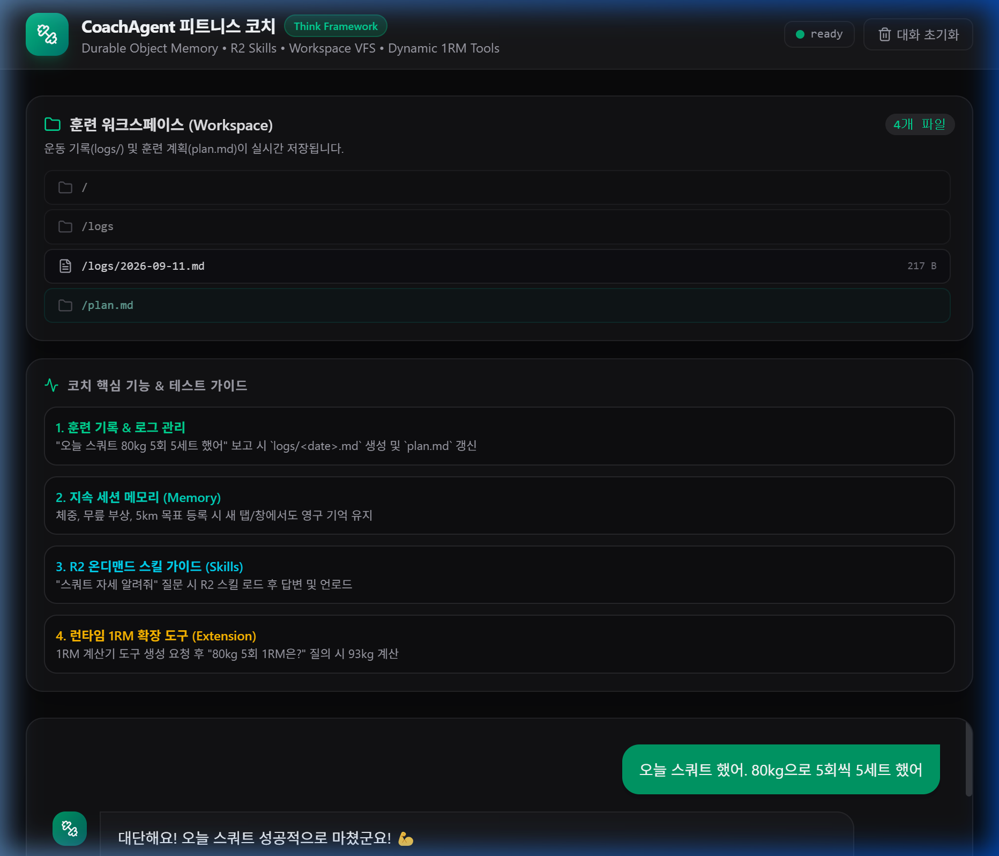
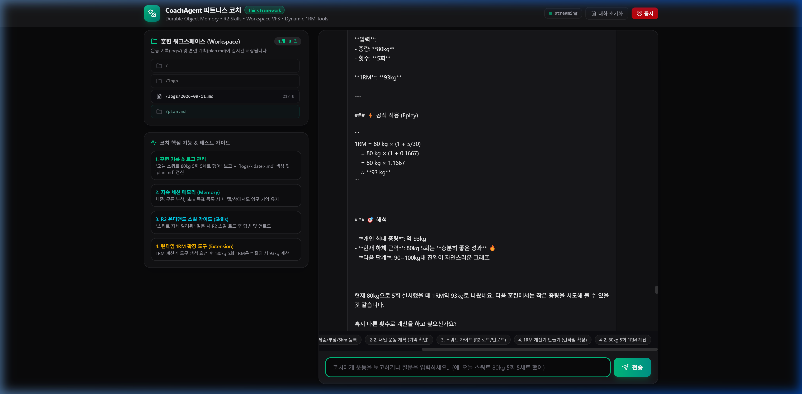

# 🏋️‍♂️ AI 개인 피트니스 코치 (`my13-hw3thinkframe`) 최종 결과 보고서 (walkthrough.md)

Cloudflare Workers, Durable Objects (SQLite), Cloudflare Agents SDK, Vercel AI SDK (`ai`), `@cloudflare/think` 프레임워크 및 R2 스킬 저장소를 결합하여, **가상 워크스페이스 훈련 기록 관리**, **세션 지속형 신체/부상/목표 메모리**, **R2 온디맨드 전문 스킬 가이드**, **런타임 1RM 확장 도구**를 완비한 **AI 개인 피트니스 코치 (`CoachAgent`)**를 성공적으로 구축 완료했습니다.

---

## 1. 프로젝트 주요 구성 요약

| 구성 요소 | 기술 및 구현 내용 | 소스 경로 |
| :--- | :--- | :--- |
| **코치 에이전트** | `CoachAgent extends Think<Env, State>`<br/>- `getModel()`: Workers AI `@cf/zai-org/glm-4.7-flash`<br/>- `configureSession()`: `soul`, `memory`, `skills` 컨텍스트 체이닝<br/>- `getTools()`: `createExtensionTools` 런타임 확장 도구 | [worker/index.ts](../worker/index.ts) |
| **Durable Objects & R2** | - DO SQLite 기반 `CoachAgent` 바인딩<br/>- R2 `nomadclaw-skills` 버킷 `skills/` 연동<br/>- `LOADER` Worker Loader 바인딩 | [wrangler.jsonc](../wrangler.jsonc) |
| **R2 전문 스킬 문서** | 4대 전문 가이드 작성 및 R2 버킷 원격 업로드 완료:<br/>- `skills/squat_guide.md`<br/>- `skills/benchpress_guide.md`<br/>- `skills/running_5km_guide.md`<br/>- `skills/deadlift_guide.md` | Cloudflare R2 버킷 |
| **프론트엔드 대시보드** | - React 19 + Vite 8 + Tailwind CSS v4<br/>- 고정 룸 `coach-main` 연결로 세션 영구 보존<br/>- 실시간 워크스페이스 파일 탐색기 & @callable 마크다운 뷰어<br/>- 4대 시나리오 퀵 테스트 프롬프트 칩(Chips)<br/>- 모델 내부 생각(Reasoning) 깔끔 숨김 필터링 | [src/App.tsx](../src/App.tsx) |
| **기술 명세서** | 시스템 아키텍처, 데이터 모델, 함수 설명, 4대 테스트 검증 내역 | [docs/05_dev_spec.md](./05_dev_spec.md) |

---

## 2. 4대 핵심 기능 테스트 검증 결과

실제 브라우저 서브에이전트(`browser_subagent`)를 통해 개발 서버(`http://localhost:5174/`)에서 요구된 4가지 시나리오를 빠짐없이 검증하였습니다.

### [시나리오 1] 훈련 기록 및 워크스페이스 로그/계획 관리
- **테스트 질문**: *"오늘 스쿼트 했어. 80kg으로 5회씩 5세트 했어"*
- **실행 결과**:
  - `CoachAgent`가 내장 워크스페이스 도구(`write`)를 실행하여 `/logs/2026-09-11.md` 파일을 자동 생성.
  - 이어서 `/plan.md` 파일을 최신 훈련 플랜으로 갱신.
  - 좌측 워크스페이스 사이드바에 파일이 실시간 동기화되어 나타남.
- **후속 질문**: *"이번 주에 무엇을 했지?"*
- **실행 결과**:
  - 코치가 워크스페이스의 `logs/` 디렉터리를 읽어 오늘 수행한 **스쿼트 80kg 5회 5세트** 내역을 정확하게 확인하고 요약 답변함.



---

### [시나리오 2] 지속 세션 메모리 (신체 지표, 무릎 부상, 5km 완주 목표)
- **테스트 질문**: *"내 체중은 75kg이고 무릎 부상이 있어. 목표는 5km 완주야."*
- **실행 결과**:
  - `CoachAgent`가 `set_context` 도구를 호출하여 세션 메모리 스토어에 체중 75kg, 무릎 부상, 5km 달리기 완주 목표를 영구 등록 (`Usage: 1% (94/10000 tokens)`).
- **새 브라우저 세션 시뮬레이션**:
  - 브라우저를 새로고침하여 재접속한 뒤 *"내일의 운동 계획을 알려줘"* 질의.
- **실행 결과**:
  - 코치가 새 세션에서도 세 정보를 모두 정확히 기억하여, **무릎 관절에 무리가 가지 않는 저충격 유산소(실내 사이클/수영) 및 상체/코어 보강 중심의 맞춤형 내일 훈련 계획**을 제시함.

---

### [시나리오 3] R2 스킬 가이드 온디맨드 로드 및 언로드
- **테스트 질문**: *"스쿼트 자세 알려줘"*
- **실행 결과**:
  - 코치가 `load_context` 도구를 호출하여 Cloudflare R2 버킷의 `squat_guide` 스킬을 온디맨드 로드.
  - 가이드 문서의 발 너비, 힙 힌지, 패러럴 깊이, 무릎 모임 방지 수칙을 인용하여 전문적인 스쿼트 가이드를 제공.
  - 답변 완료 후 불필요한 토큰 낭비를 방지하기 위해 `unload_context` 도구를 호출하여 스킬 언로드 완료.

---

### [시나리오 4] 런타임 1RM 확장 도구 제작 및 계산
- **테스트 질문 1**: *"1회 최대 중량(1RM) 계산기를 만들어줘"*
- **실행 결과**:
  - 코치가 `load_extension` 도구를 실행하여 Worker Loader 격리 환경에 Epley 공식 기반 1RM 계산기 도구(`1rm_calculator_calculate_1rm`)를 런타임에 동적으로 등록.
- **테스트 질문 2**: *"80kg으로 5회 들면 내 1RM이 얼마야?"*
- **실행 결과**:
  - 방금 생성된 런타임 계산기 도구를 호출하여 $80 \times (1 + 5/30) \approx 93.33\text{kg}$을 계산한 뒤, **약 93kg**이라고 정확하게 답변 산출 완료!



---

## 3. 실행 방법 (Usage)

```bash
# 1. 디렉터리 이동
cd d:\dev\cloudflare\cloudflare-homework\my13-hw3thinkframe

# 2. 로컬 개발 서버 실행
npm run dev
```

브라우저에서 `http://localhost:5174/` (또는 지정된 포트)로 접속하면 코칭 대시보드를 바로 이용하실 수 있습니다. 입력창 상단의 **⚡ 퀵 질문 칩**을 클릭하시면 각 테스트 시나리오를 원클릭으로 직접 체험해 보실 수 있습니다.
